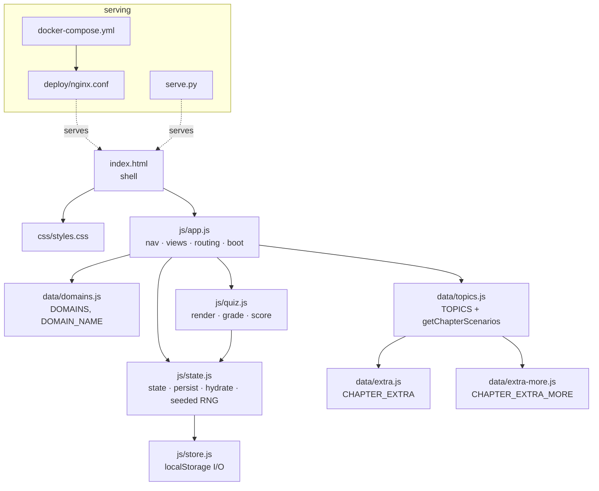

# Architecture

Single-page, no-build, ES-module web app. Static files only; a web server is
needed solely because browsers block module loading over `file://`.

## Component hub

## Data flow

- **Boot** (`app.js`): `store.load()` → `hydrate()` into `state` → render the
  last view (or the URL hash).
- **Interaction** (`quiz.js`): every answer / grade / reset calls `persist()`,
  which snapshots durable slices of `state` and writes them via `store.save()`.
- **Routing**: `location.hash` is the source of truth for `view/tab`; the
  sidebar and cards drive it through `go()`.

## Persistence model (single user, `localStorage` key `cca_progress`, v2)

| field         | meaning                                              |
|---------------|------------------------------------------------------|
| `studied[]`   | topic ids visited                                    |
| `chapterBest` | tid → best scaled scenario-exam score                |
| `bestMixed`   | best scaled mixed-exam score                         |
| `quizzes`     | inst → `{ answers, graded }`                          |
| `seeds`       | inst → integer seed driving the option shuffle       |
| `mixedSel`    | `[{tid, idx}]` — the ten chosen mixed questions      |
| `lastView`    | view to restore on next load                         |

The **seed** is the key to exact resume: option order is shuffled
deterministically from `(seed, questionIndex)`, so a reloaded quiz shows the
same layout and the saved answer indices still line up.

## Decisions

- **No build / no framework** — content is data; rendering is template strings.
  Keeps the app forkable and the diff readable.
- **Why a server at all** — ES modules only; everything else is static.
- **Docker primary, `serve.py` fallback** — user requested "nothing installed
  but Docker"; the Python server covers the no-Docker case.

## Status

| Area                    | State |
|-------------------------|-------|
| Modular split           | Done  |
| Local single-user state | Done  |
| Expanded "real deal"    | Done (21/21 chapters) |
| 10+ scenarios/chapter   | Done  |
| Docker + serve.py       | Done  |
