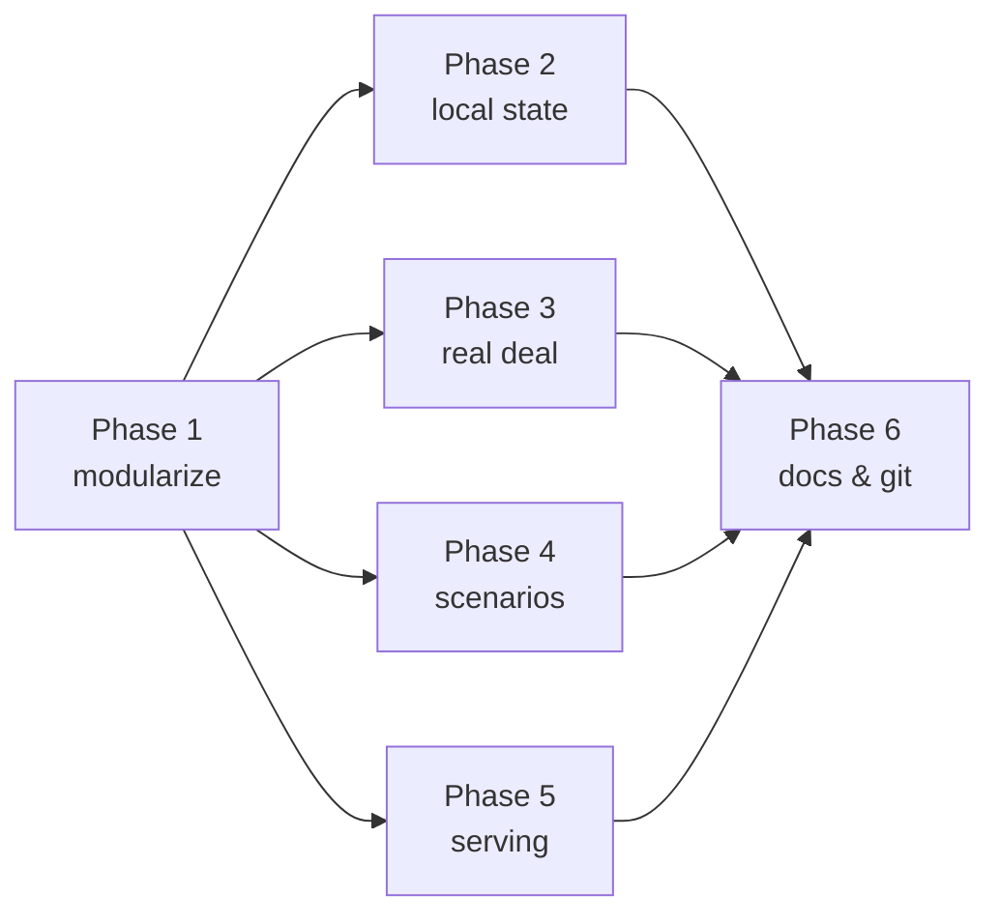

# Build order

Single source of truth for what's done and what's next on the trainer.

## Phase 1 — Restructure monolith → modules  ✅ Done
- [x] Extract `<style>` → `css/styles.css`
- [x] Split JS into `js/{app,state,store,quiz}.js` + `js/data/{domains,topics,extra,extra-more}.js`
- [x] Slim `index.html` shell loading `js/app.js` as a module
- [x] Move exam guide PDF → `docs/exam-guide.pdf`

## Phase 2 — Local single-user persistence  ✅ Done
- [x] Replace `window.storage` host bridge with `localStorage` (`store.js`)
- [x] Versioned schema (v2) + migration from the old `{studied, bestMixed}` blob
- [x] Persist answers, graded state, per-chapter best, best mixed, last view
- [x] Seeded shuffle so a resumed quiz restores its exact option order
- [x] Sidebar data tools: Export JSON / Import JSON / Reset

## Phase 3 — Expand "the real deal"  ✅ Done
- [x] All 21 chapters: deeper mechanism, edge cases, exam-trap callouts
- [x] CSS for rich real-deal content (`h4`, `ul`, `.edge` blocks)

## Phase 4 — Scenario banks ≥ 10 per chapter  ✅ Done
- [x] Domain 1 already at 10 each (no change)
- [x] Domains 2–5 topped up in `extra-more.js`

## Phase 5 — Containerized serving  ✅ Done
- [x] `docker-compose.yml` (nginx:alpine, read-only mount, port 8088)
- [x] `deploy/nginx.conf` (module MIME types, no-cache)
- [x] `serve.py` Docker-free fallback (stdlib, colored output, argparse)

## Phase 6 — Docs & repo  ✅ Done
- [x] `README.md`, `plans/` (architecture, build order, open questions)
- [x] `git init` + first commit
- [x] Push to remote

## Dependency map

## Deferred / not done
- [ ] Per-question review history (only best scores are kept, not attempt logs)
- [ ] Cross-device sync (intentionally out of scope — single user, single device)
